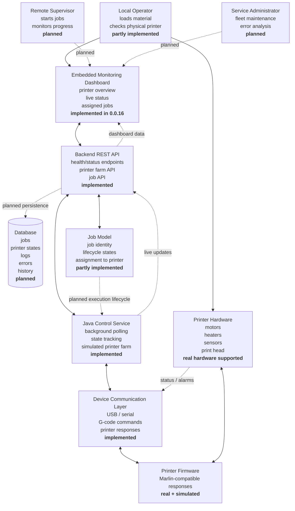
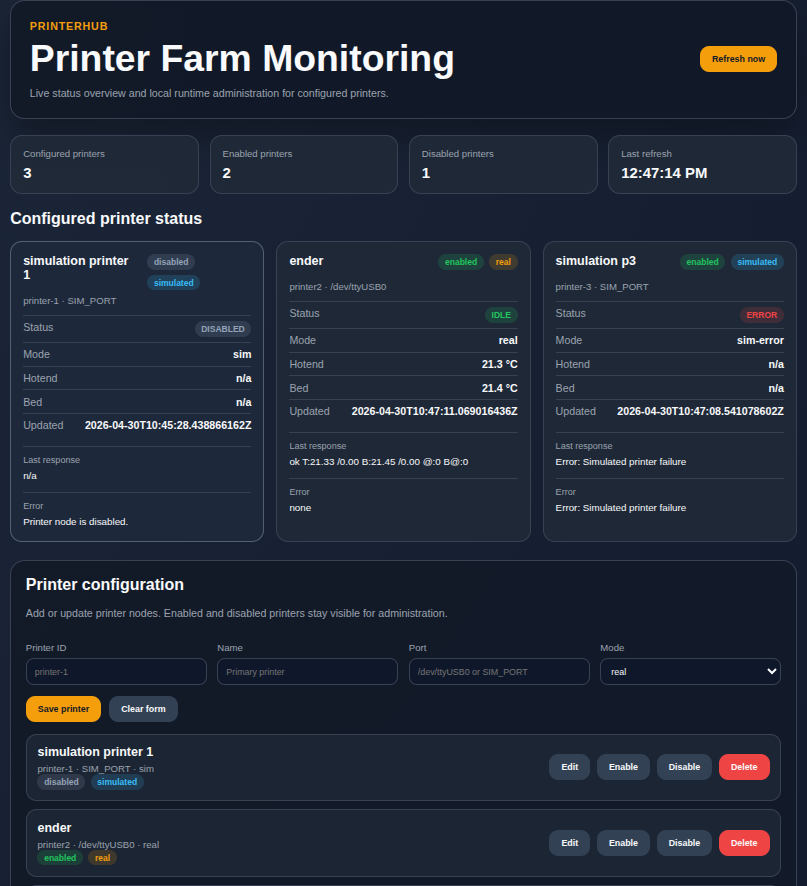

<p align="center">
  
</p>

# PrinterHub

**PrinterHub** is a Java-based system-integration prototype that simulates how industrial printer farms are monitored, controlled, and automated.

The project starts with direct serial communication to a real **Creality Ender-3 V2 Neo** printer and incrementally evolves toward an industrial-style architecture including centralized monitoring, job management, REST APIs, database persistence, and multi-printer orchestration.

The Ender-3 printer serves as a physical reference device representing the lower hardware layer of a larger industrial workflow.

---

## Industrial Motivation

Modern laboratory and industrial printers — including bio-printers — are rarely isolated devices.

They operate as part of a **centralized software environment** where users:

- monitor multiple printers remotely
- upload printable jobs
- track printer state
- respond to failures
- maintain operational logs
- manage printer fleets

PrinterHub simulates this environment step by step, starting from hardware-level communication and progressing toward distributed system integration.

For the full industrial context:

- see [`docs/industrial-bio-printer-simulation.md`](docs/industrial-bio-printer-simulation.md)

---

## Target Architecture

PrinterHub evolves toward a centralized printer-farm structure.




Current development focuses on the **Java control service and serial communication layer**, which form the foundation of the system.

---

## Current Capabilities

PrinterHub provides a simulated industrial-style printer control service.

Implemented:

- serial communication with printer firmware
- continuous background polling
- REST API for printer monitoring
- failure simulation (disconnect, timeout, error)
- in-memory printer farm simulation
- job creation and assignment to printers
- embedded monitoring dashboard
- SQLite-based persistence for jobs, events, and printer snapshots
- snapshot history API
- automated tests with CI verification 
- job execution lifecycle simulation (ASSIGNED → RUNNING → COMPLETED)
- database migration strategy preparation (SQLite → PostgreSQL)

Planned:

- connection of job execution to real printer runtime
- advanced snapshot filtering (temperature threshold)

See full roadmap:

- [`docs/roadmap.md`](docs/roadmap.md) 

---

## Monitoring Dashboard

The embedded dashboard provides a live overview of the simulated printer farm.



---

## Hardware Reference Setup

Primary test hardware:

Printer:

* Creality Ender-3 V2 Neo
* Firmware: Marlin (factory default)

Connection:

* USB-C to USB-A cable
* Linux device path: `/dev/ttyUSB0`

Detected interface:

```text
ch341-uart converter detected
attached to ttyUSB0
```

---

## Quickstart

To build and run the project:

* see [`docs/quickstart.md`](docs/quickstart.md)

---

## DevOps and Testing

Continuous Integration is implemented using Jenkins.

Current CI workflow:

```text
Checkout → Build → Test → Verify → Archive Reports
```

Includes:

* Maven build verification
* automated test execution
* JaCoCo coverage reporting
* hardware-independent simulation execution

Details:

* [`docs/devops.md`](docs/devops.md)

---

## Repository Structure

```text
printer-hub/
├── README.md
├── Jenkinsfile
├── docs/
│   ├── quickstart.md
│   ├── industrial-bio-printer-simulation.md
│   ├── roadmap.md
│   ├── devops.md
│   ├── interface-discovery.md
│   └── version.md
├── src/
│   ├── main/java/
│   └── test/java/
└── pom.xml
```

---

## Why This Project Matters

Industrial printers — especially in laboratory and medical environments — depend on reliable software systems that manage communication, monitoring, automation, and traceability.

PrinterHub explores the transition from:

```text
single USB-connected printer
```

to:

```text
centralized monitored printer farm
```

This makes the project useful as:

* a system-integration learning platform
* an industrial architecture simulation
* a structured Java communication prototype
* a foundation for distributed printer control systems

---

## License

MIT License.

See:

* [`LICENSE`](LICENSE)
 
