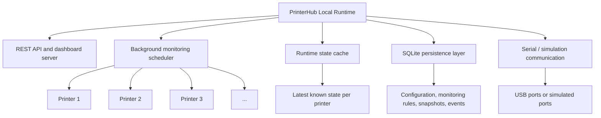
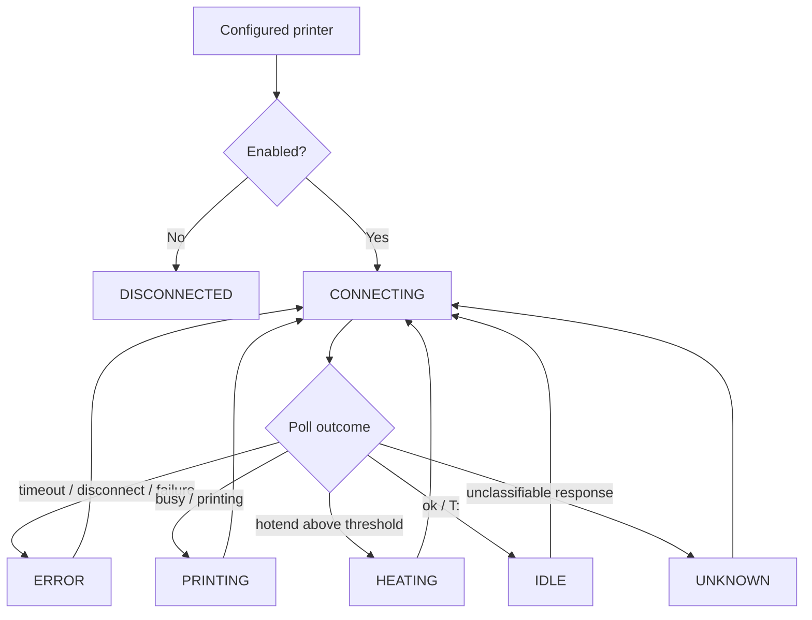
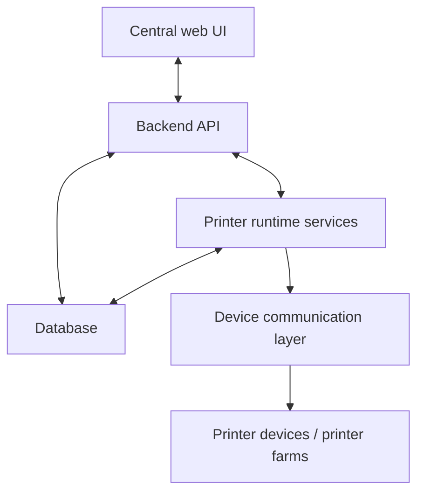

 
<p align="center">
  
</p>

# PrinterHub

**PrinterHub** is a Java-based system integration project for monitoring and controlling 3D printers in a structured runtime environment.

It started with direct serial communication to a real **Creality Ender-3 V2 Neo** and is now evolving into a **local multi-printer runtime architecture** with background monitoring, persistence, REST API access, and dashboard support.

Roadmap:

* [`docs/roadmap.md`](docs/roadmap.md)

---

## Current scope

Current focus:

```text
0.2.x — local runtime administration and job management
````

Current implemented baseline:

```text
0.2.0 — monitoring configuration and dashboard administration basics
```

Next focus:

```text
0.2.1+ — manual commands, jobs, history, and runtime packaging
```

The current `0.2.0` baseline provides:

* local multi-printer runtime
* background monitoring per configured printer
* runtime state cache
* REST API for printer administration
* SQLite persistence for configuration, snapshots, events, and monitoring rules
* embedded dashboard for printer administration
* global monitoring configuration through the API and dashboard
* simulation modes for normal and failing printer behavior
* Jenkins CI verification and runtime smoke tests

The implementation is intentionally still local-runtime oriented.

It is the foundation for later:

* controlled manual command execution
* job lifecycle handling
* audit and history views
* stronger real-device administration
* multi-site orchestration

---

## Current runtime architecture



Operational rule:

```text
The API reads runtime state from the cache.
Background monitoring performs the polling.
Normal status and dashboard reads must not poll printers directly.
```

---

## Monitoring configuration

The current `0.2.0` implementation supports runtime-global monitoring rules.

Available settings:

```text
poll interval
snapshot minimum interval
temperature delta threshold
event deduplication window
error persistence behavior
```

These rules are currently global to the runtime and not yet printer-specific.

---

## Dashboard

Current runtime state can be viewed through the embedded dashboard.

<p align="center">
  
</p>

The dashboard supports:

* live printer cards
* configured printer administration
* enable / disable handling
* clearer distinction between:

  * enabled and disabled printers
  * failing and intentionally disabled printers
  * real and simulated printers
* monitoring rule editing

The dashboard is part of the current local runtime architecture and reads only from the API layer.

---

## Printer state machine

Each monitored printer node follows the same runtime state model.



Defined states:

```text
DISCONNECTED
CONNECTING
IDLE
HEATING
PRINTING
ERROR
UNKNOWN
```

This state model is part of the current runtime behavior and is used by monitoring, persistence, API output, and dashboard rendering.

---

## Target architecture direction

The longer-term direction goes beyond a local runtime and moves toward centralized orchestration.



This target is not fully implemented yet.

It represents the intended direction after the local runtime foundation is stable.

---

## Industrial context

PrinterHub is not just a single-printer control exercise.

It models the transition from:

```text
single USB-connected printer
```

toward:

```text
structured multi-printer runtime monitoring and administration
```

and later:

```text
centralized multi-site printer management
```

Related background:

* [`docs/industrial-bio-printer-simulation.md`](docs/industrial-bio-printer-simulation.md)

---

## DevOps and verification

PrinterHub uses Jenkins-based CI.

The current pipeline verifies:

* Maven build and test execution
* runtime/API smoke lifecycle
* robustness scenarios with mixed healthy and failing printers
* JaCoCo coverage reporting
* release bundle preparation

Details:

* [`docs/devops.md`](docs/devops.md)

---

## Repository structure

```text
printer-hub/
├── README.md
├── Jenkinsfile
├── docs/
│   ├── roadmap.md
│   ├── developer.md
│   ├── install.md
│   ├── quickstart.md
│   ├── devops.md
│   ├── industrial-bio-printer-simulation.md
│   └── version.md
├── src/
│   ├── main/java/printerhub/
│   │   ├── api/
│   │   ├── config/
│   │   ├── monitoring/
│   │   ├── persistence/
│   │   ├── runtime/
│   │   └── serial/
│   └── test/java/
└── pom.xml
```

---

## Documentation

* Setup and prerequisites: [`docs/install.md`](docs/install.md)
* Local usage: [`docs/quickstart.md`](docs/quickstart.md)
* Developer reference: [`docs/developer.md`](docs/developer.md)
* CI and release workflow: [`docs/devops.md`](docs/devops.md)
* Planned evolution: [`docs/roadmap.md`](docs/roadmap.md)

---

## License

MIT License

* [`LICENSE`](LICENSE)

---
 