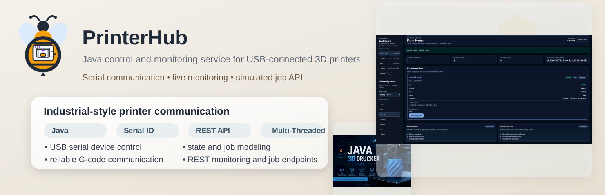
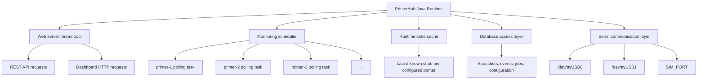
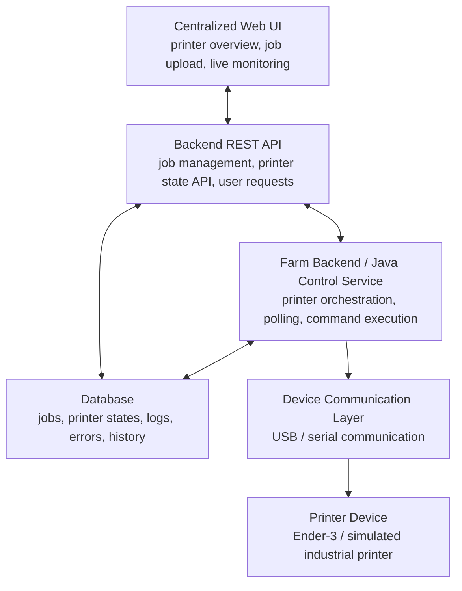

<p align="center">
  
</p>

# PrinterHub

**PrinterHub** is a Java-based system-integration project that models how industrial printer farms are monitored and controlled.

The project began with direct serial communication to a real **Creality Ender-3 V2 Neo** printer and is now entering a **major architectural refactoring phase**.

---

# ⚠️ Work in Progress — Runtime Refactoring

PrinterHub is currently being refactored to establish the final **local farm runtime architecture**.

This phase introduces:

* multi-threaded printer monitoring
* runtime-based printer orchestration
* background polling scheduler
* runtime state cache
* clean separation between API and hardware polling

During this phase:

```text
Features from 0.0.x are being reorganized
into a new runtime backbone (0.1.x).
```

Some previously implemented features may be temporarily unavailable while the architecture stabilizes.

For the full design plan:

→ See [`docs/roadmap.md`](docs/roadmap.md)

---

# Local Runtime Architecture



---

# Target Project Architecture



---
 
# Industrial Context

Modern laboratory and industrial printers are rarely standalone devices.

They operate inside structured environments where:

* multiple printers run simultaneously
* failures must be isolated
* monitoring runs continuously
* operations must remain responsive
* hardware communication must be abstracted

PrinterHub models this transition from:

```text
single USB printer
```

to:

```text
multi-printer runtime environment
```

and eventually:

```text
multi-site centralized printer orchestration
```

See:

* [`docs/industrial-bio-printer-simulation.md`](docs/industrial-bio-printer-simulation.md)

---

# DevOps and Continuous Integration

PrinterHub uses Jenkins-based CI.

Current CI pipeline validates:

```text
Branch checkout
Build verification
Runtime startup
API health check
Multi-printer monitoring activity
```

Details:

* [`docs/devops.md`](docs/devops.md)

---

# Repository Structure (0.1.x)

```text
printer-hub/
├── README.md
├── Jenkinsfile
├── docs/
│   ├── roadmap.md
│   ├── devops.md
│   ├── industrial-bio-printer-simulation.md
│   └── version.md
├── src/
│   ├── main/java/printerhub/
│   │   ├── runtime/
│   │   ├── monitoring/
│   │   ├── api/
│   │   ├── persistence/
│   │   └── serial/
│   └── test/java/
└── pom.xml
```

---

# Roadmap

PrinterHub evolves in staged architecture steps:

```text
0.0.x — Prototype validation (completed)
0.1.x — Runtime architecture (in progress)
0.2.x — Local administration features
1.0.x — Multi-farm centralized management
```

Full details:

→ [`docs/roadmap.md`](docs/roadmap.md)

---

# License

MIT License.

See:

* [`LICENSE`](LICENSE)
 