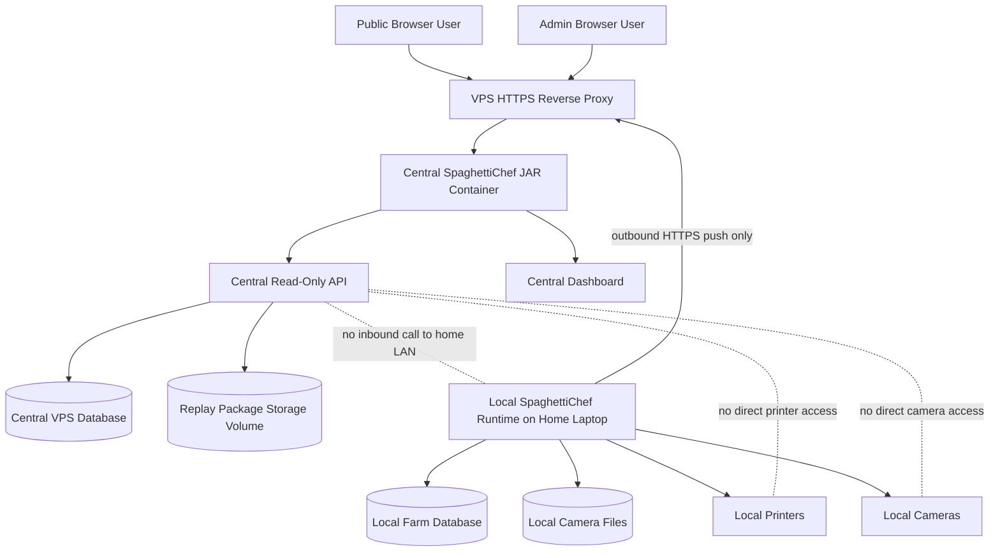
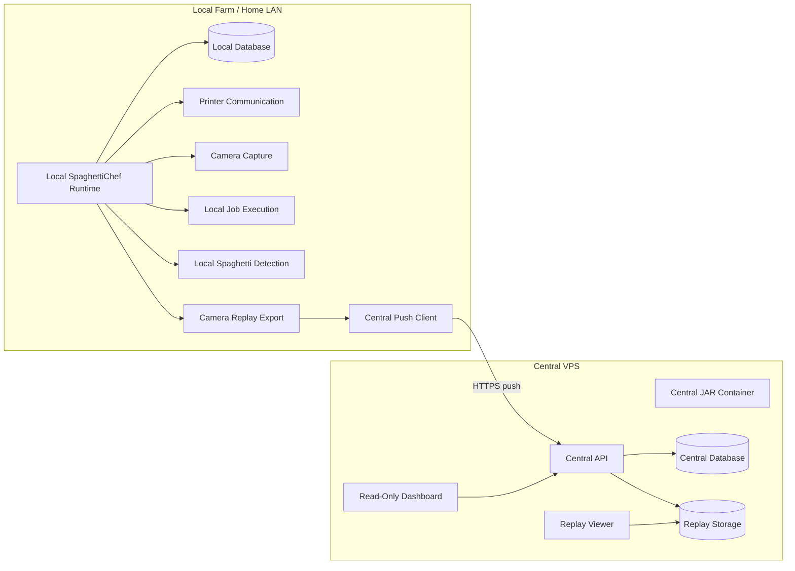
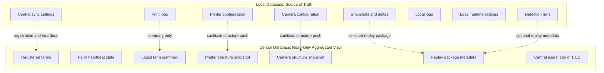
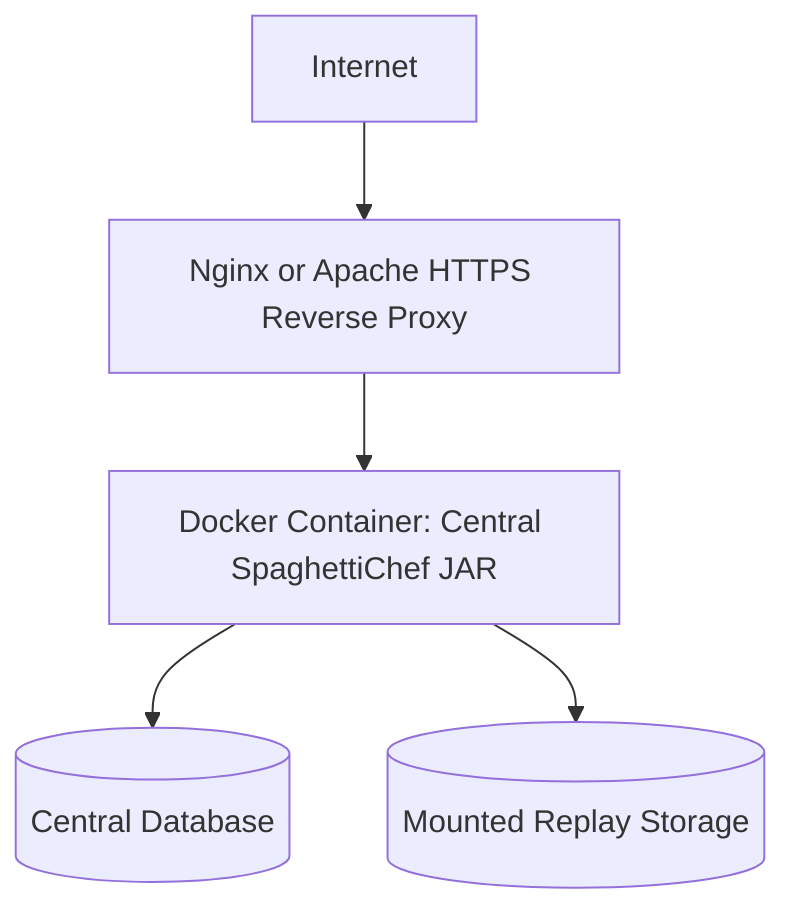
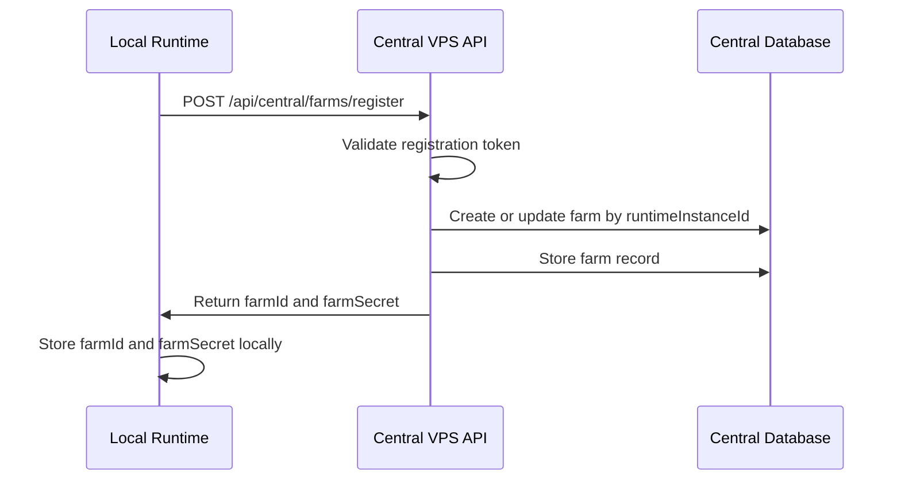
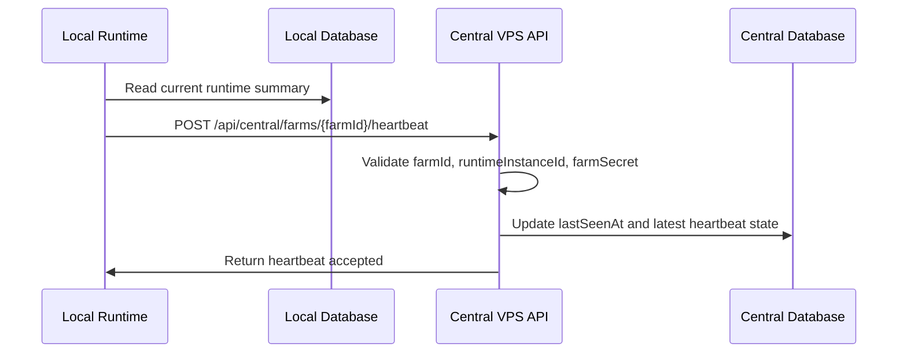
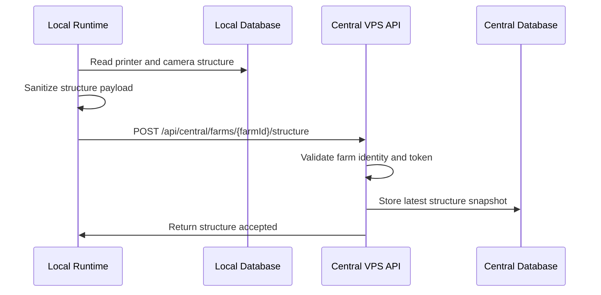
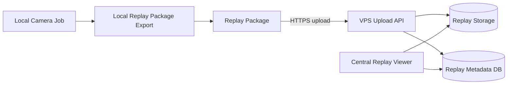
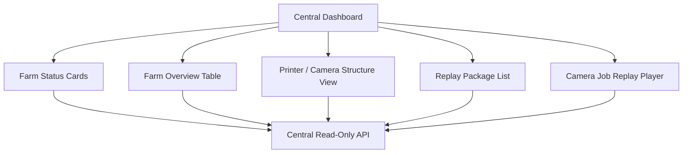

# 1.0.x — Central Read-Only VPS Viewer

## Goal

Introduce a central VPS platform that can safely observe one or more local SpaghettiChef runtimes without exposing the local farm to the public internet.

The first 1.0.x goal is not remote control. It is a public or semi-public read-only central viewer.

The VPS should be able to show:

* registered farms
* farm online/offline status
* printer names and structure
* camera names and structure
* selected camera job replay packages
* latest synchronized farm summaries

The VPS must not be able to directly control printers, cameras, or local jobs in this series.

## Core Security Rule

```text
The local farm is private.
The VPS is public.
The local farm pushes selected data to the VPS.
The VPS never opens an inbound connection to the local farm.
The VPS never communicates directly with USB printers or cameras.
```

## Architecture Decision

The central VPS and each local farm are separate systems with separate databases.

The databases do not synchronize directly.

Correct model:

```text
Local runtime reads local database.
Local runtime sends selected sanitized data to the central VPS API.
Central API validates the request.
Central API writes its own central database.
Central dashboard reads only the central database.
```

Wrong model:

```text
Local database <-> Central database
```

The central VPS stores an aggregated, read-only copy of selected farm information. It is not the source of truth for local printer execution.

---

## Target Deployment Architecture



## Runtime Responsibility Split



## Data Ownership



## Public Safety Boundary

The 1.0.x central dashboard may show:

* farm display name
* farm online/offline/stale state
* printer display names
* camera display names
* printer count
* camera count
* active print count
* warning count
* spaghetti alert count
* last seen time
* uploaded replayable camera jobs
* replay frames that were explicitly pushed to the VPS

The 1.0.x central dashboard must not expose:

* start print
* stop print
* pause print
* emergency stop
* upload G-code to local farm
* edit printer configuration
* edit camera configuration
* delete local farm files
* trigger local camera capture
* run local shell commands
* run arbitrary analysis code
* open inbound connection to home LAN
* expose local LAN IPs or local file paths publicly

---

# Existing Before 1.0.x

Already available in the local SpaghettiChef runtime:

* local Java backend
* local dashboard
* local printer handling
* local camera handling
* local camera jobs
* local snapshot and delta storage
* local spaghetti detection work
* local database
* local settings
* local API and dashboard patterns

Missing before 1.0.x:

* central VPS read-only mode
* central JAR/container deployment model
* central farm database
* local-to-central registration
* local-to-central heartbeat
* farm structure snapshot push
* camera replay package upload
* central replay storage
* central read-only dashboard


---

## Existing Local Runtime Protection Rules

The central VPS work must not redesign, replace, or weaken the existing local SpaghettiChef runtime.

The local runtime already has its own safety and authorization model from `0.3.0 — Local Security, Roles, and Dangerous Action Guards`.

Already implemented locally:

* local roles: `VIEWER`, `OPERATOR`, `ADMIN`
* persisted local security settings
* persisted local role profiles
* backend authorization guards
* dangerous action confirmation model
* dashboard role-aware controls
* local operator audit events
* protection for heating, movement, homing, fan control, SD delete, upload/overwrite, print start, pause/resume/cancel, emergency stop, streamed G-code execution, and raw command execution

The central VPS must not replace these local guards.

The local runtime remains the final authority for any local hardware action.

```text
Central role checks do not replace local role checks.
Central permissions do not bypass local permissions.
Central requests do not bypass dangerous-action confirmations.
Central audit does not replace local operator audit.
```

In `1.0.x`, the VPS is read-only and must not request hardware actions.

In later `1.1.x+`, if central controlled actions are introduced, the local runtime must still validate the request with its existing local security model before doing anything.


## Build Artifact Strategy

The existing local build artifacts must remain intact.

Already existing build/deployment outputs include:

* admin deployment package for local farm deployment from the local LAN
* local farm JAR/package for Windows
* local farm JAR/package for Linux
* optional dataset/test package or JAR
* Jenkins pipeline that prepares the local runtime artifacts

The 1.0.x central VPS work should add a new central artifact. It must not replace the existing local farm artifacts.

Expected future artifacts:

```text
spaghettichef-local-admin-package
spaghettichef-local-windows-package
spaghettichef-local-linux-package
spaghettichef-dataset-test-package, optional
spaghettichef-central-vps-container
```

The central VPS artifact should run in central/read-only mode.

The local runtime artifacts should continue to run the local farm.

## Jenkins / CI Direction

The Jenkins pipeline should be extended, not rewritten.

The new pipeline work should add:

* central VPS build step
* central container image build, if Docker is used
* central runtime configuration example
* central database initialization/migration step
* central replay storage volume documentation
* optional smoke test for central health endpoint
* optional smoke test for central farm registration endpoint

The Jenkins work must not remove or break existing local artifacts.

## Database Strategy

The local database and central database are separate.

The local database is not redefined by the VPS work.

The central database is new and belongs only to the VPS platform.

```text
Local database:
  source of truth for printers, cameras, jobs, snapshots, deltas, detection runs, local settings, local roles, and local audit

Central database:
  source of truth for registered farms, latest farm status, pushed structure snapshots, replay package metadata, central users later, central audit later
```

There is no direct database-to-database synchronization.

The only allowed data flow is:

```text
local runtime -> authenticated HTTPS API -> central VPS database
```

## Local Database: Must Not Be Redesigned

The 1.0.x central VPS work must not redesign the existing local schema.

It may only add local central-sync settings if needed, for example:

```text
centralSyncEnabled
centralBaseUrl
runtimeInstanceId
farmId
farmSecret
lastRegistrationAt
lastHeartbeatAt
lastStructurePushAt
lastReplayUploadAt
```

These settings support outbound communication to the VPS.

They do not change local printer/job/camera ownership.

## Central Database: New Tables

The first central VPS implementation may add central-only tables such as:

```text
central_farm
central_replay_package
central_replay_file
```

Later `1.1.x` may add:

```text
central_user
central_role
central_user_role
central_audit_event
central_farm_token
```

The first version may keep farm latest status and structure JSON directly on `central_farm` to stay simple.

Suggested first central table:

```text
central_farm
```

Suggested fields:

```text
id
farm_id
runtime_instance_id
farm_name
runtime_version
hostname
display_location
description
enabled
status
registered_at
last_seen_at
printer_count
camera_count
active_print_count
warning_count
error_count
spaghetti_alert_count
structure_json
structure_updated_at
last_status_message
last_summary_json
created_at
updated_at
metadata_json
```

Suggested replay tables for later 1.0.x:

```text
central_replay_package
central_replay_file
```

Suggested `central_replay_package` fields:

```text
id
package_id
farm_id
runtime_instance_id
camera_job_id
printer_id
camera_id
label
started_at
finished_at
frame_count
delta_count
visibility
manifest_json
created_at
updated_at
```

Suggested `central_replay_file` fields:

```text
id
package_id
file_type
relative_path
content_type
size_bytes
created_at
```

## Central Mode Must Be Explicit

The central VPS runtime should be explicit.

Possible configuration:

```text
SPAGHETTICHEF_MODE=central
```

or:

```text
CENTRAL_MODE=true
```

When running in central mode:

* do not initialize local printer communication
* do not start local camera capture
* do not start local printer jobs
* do not expose local printer-control endpoints
* do not require local printer/camera configuration
* expose central farm registration, heartbeat, structure, replay, and dashboard endpoints

When running in local mode:

* keep existing local runtime behavior
* do not require central database
* central sync is optional
* local printer/camera/job behavior remains unchanged

## Safety Requirement For Codex

Codex must not convert the local runtime into the central runtime.

Codex must not merge the local database model into the central database model.

Codex must not remove or weaken the existing `0.3.0` local authorization, dangerous-action confirmation, or audit model.

Codex should add central functionality as a new mode, package, module, route group, or clearly separated implementation, following existing project conventions.

Implemented 1.0.0 package boundary:

```text
src/main/java/spaghettichef/Main.java              compatibility dispatcher only
src/main/java/spaghettichef/local/                local farm runtime
src/main/java/spaghettichef/central/              central read-only VPS runtime
src/main/java/spaghettichef/shared/               small shared utilities only
```

The local and central code paths must not import each other. Shared code should stay small and generic.


---

# 1.0.0 — Safe Central Read-Only Architecture

## Status

Done.

## Purpose

Define and prepare the central VPS architecture as a safe public read-only viewer.

This step creates the architectural boundary before implementing farm registration, heartbeat, structure sync, and replay upload.

## Scope

Define:

* central VPS deployment shape
* central/local runtime boundary
* central database ownership
* local database ownership
* push-only communication model
* read-only public dashboard rules
* forbidden remote-control actions

## Deployment Direction

The central VPS application should run as a JAR inside a container.

Recommended deployment:



The reverse proxy exposes HTTPS to the world.

The Java container should not be exposed directly if a reverse proxy is available.

 
## Local-to-Central Communication

The first communication model is push-only:

```text
local runtime -> central VPS
```

No port forwarding is required on the home router.

No inbound connection to the local farm is required.

## Local Central-Sync Settings

The local runtime should later persist central connection settings.

Suggested local settings:

```text
centralSyncEnabled
centralBaseUrl
runtimeInstanceId
farmId
farmSecret
lastRegistrationAt
lastHeartbeatAt
lastStructurePushAt
lastReplayUploadAt
```

## Non-Goals

This version does not implement:

* remote printer control
* central job dispatch
* public admin actions
* bidirectional control protocol
* full user/role system
* long-term sync protocol
* central operational history

## Acceptance Criteria

* Central read-only architecture is documented.
* Local runtime remains the owner of printer and camera communication.
* VPS is defined as public read-only viewer.
* Local farm remains private behind the home LAN/router.
* Communication is push-only from local farm to VPS.
* No database-to-database synchronization is introduced.
* Forbidden remote-control actions are explicitly listed.
* Containerized VPS deployment direction is defined.

---

# 1.0.1 — Farm Registration and Heartbeat

## Status

Done.

## Purpose

Allow a local SpaghettiChef runtime to register with the central VPS and periodically report that it is alive.

This creates the first real connection between the private local farm and the public VPS without exposing the home LAN.

## Scope

Implement central farm registration and heartbeat.

The local runtime identifies itself with a stable `runtimeInstanceId`.

The central VPS assigns a stable `farmId`.

## Farm Identity

A farm represents one local SpaghettiChef runtime installation.

Identity rules:

```text
farmId = stable central identifier assigned by the VPS
runtimeInstanceId = stable local runtime identifier generated by the local farm
farmName = human-readable display name
hostname = informational only
IP address = not identity
```

The central platform must not use hostname or IP address as the farm identity.

## Registration Flow



## Heartbeat Flow



## Suggested Central Table

```text
central_farm
```

Suggested fields:

```text
id
farm_id
runtime_instance_id
farm_name
runtime_version
hostname
display_location
description
enabled
status
registered_at
last_seen_at
printer_count
camera_count
active_print_count
warning_count
error_count
spaghetti_alert_count
last_status_message
last_summary_json
created_at
updated_at
metadata_json
```

For the first implementation, latest summary fields may live directly on `central_farm`.

A separate history table can be introduced later.

## Suggested Endpoints

```text
POST /api/central/farms/register
POST /api/central/farms/{farmId}/heartbeat
GET  /api/central/farms
GET  /api/central/farms/{farmId}
GET  /api/central/farms/overview
```

## Registration Request

```json
{
  "runtimeInstanceId": "runtime-home-laptop-001",
  "farmName": "Home Farm",
  "runtimeVersion": "1.0.0",
  "hostname": "spaghettichef-laptop",
  "displayLocation": "Home LAN",
  "metadata": {
    "os": "linux",
    "javaVersion": "21",
    "cameraEnabled": true
  }
}
```

## Heartbeat Request

```json
{
  "runtimeInstanceId": "runtime-home-laptop-001",
  "runtimeVersion": "1.0.0",
  "status": "ONLINE",
  "printerCount": 3,
  "cameraCount": 2,
  "activePrintCount": 1,
  "warningCount": 0,
  "errorCount": 0,
  "spaghettiAlertCount": 0,
  "message": "ok"
}
```

## Status Values

```text
ONLINE
STALE
OFFLINE
DISABLED
```

Suggested first interpretation:

```text
ONLINE  = last heartbeat within 2 minutes
STALE   = last heartbeat older than 2 minutes
OFFLINE = last heartbeat older than 10 minutes
DISABLED = farm exists but central tracking is disabled
```

## Non-Goals

This version does not implement:

* printer-level structure sync
* camera-level structure sync
* replay upload
* central job dispatch
* remote control actions
* central user/role management
* central operational history

## Acceptance Criteria

* A local runtime can register with the central VPS.
* Central VPS assigns or returns a stable `farmId`.
* Re-registering the same `runtimeInstanceId` does not create duplicates.
* Farm heartbeat updates `lastSeenAt`.
* Farm heartbeat updates latest summary counters.
* Unknown farm heartbeat is rejected.
* Mismatched `runtimeInstanceId` is rejected.
* Disabled farm heartbeat is rejected.
* Farm overview API returns online/stale/offline state.
* No inbound access to the local farm is required.

---

# 1.0.2 — Farm Structure Snapshot

## Status

Done.

## Purpose

Allow the local farm to push a sanitized read-only description of its local structure to the VPS.

This lets the public dashboard show printers and cameras without exposing control actions.

## Scope

Implement a structure snapshot pushed from the local runtime to the VPS.

The structure snapshot should describe:

* farm
* printers
* cameras
* printer-camera relationships
* display names
* enabled/disabled state
* basic public-safe metadata

It should not include dangerous or sensitive data.

## Structure Push Flow



## Suggested Endpoint

```text
POST /api/central/farms/{farmId}/structure
GET  /api/central/farms/{farmId}/structure
```

## Suggested Payload

```json
{
  "runtimeInstanceId": "runtime-home-laptop-001",
  "generatedAt": "2026-05-31T10:30:00Z",
  "printers": [
    {
      "printerId": "p1",
      "displayName": "Ender 3",
      "enabled": true,
      "status": "PRINTING"
    },
    {
      "printerId": "p2",
      "displayName": "Sidewinder",
      "enabled": true,
      "status": "IDLE"
    }
  ],
  "cameras": [
    {
      "cameraId": "cam1",
      "displayName": "Front Camera",
      "printerId": "p1",
      "enabled": true
    }
  ]
}
```

## Sanitization Rules

The structure snapshot should not expose:

* local LAN IP address
* serial port names if public
* local filesystem paths
* secrets
* API tokens
* executable paths
* internal stack traces
* admin-only settings

## Storage Decision

For the first implementation, the VPS may store the latest structure snapshot as JSON.

Suggested central fields:

```text
structure_json
structure_updated_at
```

A normalized printer/camera central schema can be introduced later if needed.

## Non-Goals

This version does not implement:

* printer commands
* camera commands
* central editing of printer/camera settings
* full printer history
* snapshot upload
* replay upload

## Acceptance Criteria

* Local runtime can push a structure snapshot.
* VPS stores latest structure snapshot.
* Structure snapshot is linked to the registered farm.
* Structure push rejects unknown farms.
* Structure push rejects mismatched `runtimeInstanceId`.
* Structure push rejects disabled farms.
* Structure contains no control actions.
* Central API can return the latest structure snapshot.

---

# 1.0.3 — Camera Job Replay Package Upload

## Status

Done.

## Purpose

Allow the local farm to upload selected camera job replay packages to the VPS.

The VPS replays uploaded copies only. It does not call the local farm to replay a job.

## Scope

Implement a safe replay upload mechanism.

A replay package should contain:

* manifest
* job metadata
* selected snapshots
* selected deltas
* optional analysis results
* optional timing information

## Replay Architecture



## Replay Rule

```text
The VPS replays only data already uploaded to the VPS.
The VPS does not request live frames from the local farm.
The VPS does not trigger local camera capture.
```

## Suggested Package Layout

```text
camera-replay-package/
  manifest.json
  snapshots/
    000001.jpg
    000002.jpg
    000003.jpg
  deltas/
    000001_000002_delta.jpg
    000002_000003_delta.jpg
  analysis/
    results.json
```

## Suggested Manifest

```json
{
  "farmId": "farm-000001",
  "runtimeInstanceId": "runtime-home-laptop-001",
  "cameraJobId": "local-job-42",
  "printerId": "p1",
  "cameraId": "cam1",
  "startedAt": "2026-05-31T10:00:00Z",
  "finishedAt": "2026-05-31T10:15:00Z",
  "frameCount": 120,
  "deltaCount": 119,
  "label": "spaghetti",
  "source": "local-upload"
}
```

## Suggested Endpoints

```text
POST /api/central/farms/{farmId}/camera-replay-packages
GET  /api/central/farms/{farmId}/camera-replay-packages
GET  /api/central/camera-replay-packages/{packageId}
```

The upload format can be:

* multipart upload
* zip package upload
* manifest-first plus file uploads

The simplest first implementation may use a zip package.

## Non-Goals

This version does not implement:

* live camera streaming
* remote camera capture trigger
* remote local-file browsing
* deleting local replay files
* printer job control
* central spaghetti decision making

## Acceptance Criteria

* Local farm can upload a selected replay package.
* VPS stores replay metadata.
* VPS stores replay files in central storage.
* Replay package is linked to a registered farm.
* Replay upload rejects unknown farms.
* Replay upload rejects mismatched `runtimeInstanceId`.
* Replay upload rejects disabled farms.
* Central replay viewer can list uploaded packages.
* Central replay viewer can replay uploaded frames.
* No inbound connection to the local farm is required.

---

# 1.0.4 — Public Read-Only Central Dashboard

## Status

Done.

## Purpose

Expose a safe read-only VPS dashboard for farm observation and replay.

This dashboard may be public or semi-public, but it must not contain dangerous actions.

## Scope

Build a central dashboard that shows:

* farm list
* farm status
* printer/camera structure
* latest heartbeat
* active print count summary
* warnings/errors summary
* spaghetti alert summary
* replayable camera jobs
* replay viewer for uploaded packages

## Dashboard Layout



## Public Display Rules

The public dashboard may show:

* public farm display name
* printer display names
* camera display names
* status summaries
* selected replay packages
* sanitized replay metadata

The public dashboard must not show:

* farm secrets
* local LAN IPs
* local filesystem paths
* serial device paths
* raw backend logs
* private hostnames, unless explicitly allowed
* admin settings

## Forbidden Actions

The 1.0.x dashboard must not include buttons or endpoints for:

* start print
* stop print
* pause print
* emergency stop
* upload G-code to local farm
* delete local files
* edit local settings
* trigger camera capture
* trigger detection run
* execute shell command
* call local runtime directly

## Acceptance Criteria

* Central dashboard shows registered farms.
* Central dashboard shows online/stale/offline state.
* Central dashboard shows pushed printer/camera structure.
* Central dashboard lists uploaded replay packages.
* Central dashboard can replay uploaded camera-job frames.
* Dashboard is read-only.
* No dangerous actions are exposed.

---

# 1.0.5 — Containerized VPS Deployment

## Status

Done.

## Purpose

Run the central read-only VPS platform as a containerized JAR service.

## Scope

Define and implement deployment packaging for the VPS central application.

Expected deployment:

```text
reverse proxy HTTPS -> central SpaghettiChef container -> central database/storage
```

## Deployment Components

* Dockerfile or container build definition
* central runtime configuration
* mounted replay storage volume
* database configuration
* health endpoint
* reverse proxy example
* environment variable documentation

## Suggested Runtime Configuration

```text
CENTRAL_MODE=true
CENTRAL_DATABASE_URL=...
CENTRAL_REPLAY_STORAGE_DIR=/data/replay
CENTRAL_PUBLIC_DASHBOARD_ENABLED=true
CENTRAL_REGISTRATION_TOKEN=...
```

## Acceptance Criteria

* Central JAR can run in a container.
* Container exposes only the configured central HTTP port.
* Replay storage is mounted as persistent volume.
* Central database configuration is externalized.
* Health endpoint exists.
* Reverse proxy deployment is documented.
* Secrets are not hardcoded.

---

# 1.0.x Non-Goals

The entire 1.0.x series does not implement:

* user-specific roles
* remote printer control
* central job dispatch
* central print start/stop/pause
* editing local farm configuration from VPS
* live camera streaming
* direct VPS-to-local-farm calls
* direct VPS-to-printer calls
* full historical fleet analytics
* payment/customer tenant model
* public write actions

Those belong to later roadmap chapters.

---
