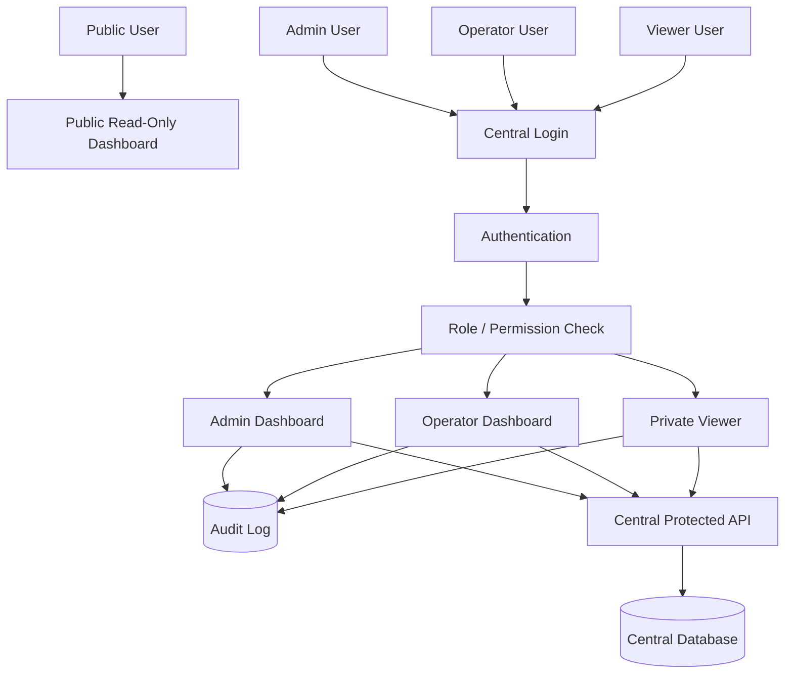

# 1.1.x — Users, Roles, Security, and Controlled Central Actions

## Goal

Introduce central users, roles, permissions, protected admin views, audit logging, and the first carefully controlled central actions.

The 1.1.x series builds on the safe read-only central VPS viewer from 1.0.x.

The central platform may start to support selected actions only after authentication, authorization, and audit logging are in place.

## Core Rule

```text
No central write/action feature is allowed before users, roles, permissions, and audit history exist.
```

The central VPS must remain safe by default.

## Relationship With 1.0.x

1.0.x creates:

* central read-only VPS viewer
* registered farms
* farm heartbeat
* farm structure snapshots
* replay package upload
* read-only replay dashboard
* containerized central deployment

1.1.x adds:

* central login
* central users
* central roles
* public vs admin views
* permissions
* audit log
* farm token management
* protected admin settings
* selected controlled actions, later

## Security Boundary

The central platform has two visibility levels:

```text
Public view:
  read-only
  sanitized
  no login required, if enabled
  no dangerous details
  no actions

Admin/operator view:
  login required
  role-based permissions
  audit logged
  may access technical details
  may later request controlled actions
```

## Target Access Model



---

## Local and Central Role Compatibility

The existing local roles remain unchanged:

```text
VIEWER
OPERATOR
ADMIN
```

The future central roles may reuse similar names, but they apply only to the central VPS platform:

```text
CENTRAL_PUBLIC_VIEWER
CENTRAL_VIEWER
CENTRAL_OPERATOR
CENTRAL_ADMIN
```

Meaning:

```text
Local VIEWER:
  local read-only runtime access

CENTRAL_VIEWER:
  logged-in read-only VPS access

Local OPERATOR:
  local operational role, guarded by local permissions and confirmations

CENTRAL_OPERATOR:
  may later request selected central actions, but cannot bypass local validation

Local ADMIN:
  manages local runtime security/settings

CENTRAL_ADMIN:
  manages central users, farms, tokens, visibility, and central audit
```

A central role is not automatically a local role.

A central user is not automatically a local runtime user.

A central action request, if introduced later, must carry enough identity and context for the local runtime to decide whether to accept or reject it.


---

# 1.1.0 — Central User Accounts and Login

## Status

Future.

## Purpose

Add central user accounts and login to the VPS platform.

This creates the foundation for protecting admin pages and future controlled actions.

## Scope

Implement central authentication for the VPS.

The system should support:

* central user account
* password-based login, initially
* logout
* authenticated session or token
* protected admin routes
* clear separation between public dashboard and protected dashboard

## Suggested User Fields

```text
userId
username
displayName
email
passwordHash
enabled
createdAt
updatedAt
lastLoginAt
```

## Public vs Protected Areas

Public area:

```text
/public
/dashboard
/replay
```

Protected area:

```text
/admin
/admin/farms
/admin/security
/admin/audit
```

Exact paths may follow existing project conventions.

## Non-Goals

This version does not implement:

* central printer actions
* central job dispatch
* OAuth/social login
* multi-tenant customer model
* payment model
* complex role model

## Acceptance Criteria

* Central users can log in.
* Central users can log out.
* Protected admin views require login.
* Public read-only dashboard can remain public if enabled.
* Passwords are stored hashed, never plain text.
* Disabled users cannot log in.
* Authentication errors are clear but do not leak sensitive information.

---

# 1.1.1 — Roles and Permissions

## Status

Future.

## Purpose

Add role-based access control to the central VPS platform.

This prepares the system for safe operational features.

## Initial Roles

Suggested first roles:

```text
CENTRAL_PUBLIC_VIEWER
CENTRAL_VIEWER
CENTRAL_OPERATOR
CENTRAL_ADMIN
```

## Role Meaning

```text
CENTRAL_PUBLIC_VIEWER:
  no login
  can see sanitized public dashboard only

CENTRAL_VIEWER:
  logged in
  can see private read-only details
  cannot change anything

CENTRAL_OPERATOR:
  logged in
  can use selected operational features later
  cannot manage users or security settings

CENTRAL_ADMIN:
  logged in
  can manage users, farms, tokens, security settings, and future actions
```

## Permission Model

Permissions should be explicit, even if roles are simple at first.

Suggested permissions:

```text
CENTRAL_VIEW_PUBLIC
CENTRAL_VIEW_PRIVATE
CENTRAL_VIEW_TECHNICAL_DETAILS
CENTRAL_MANAGE_USERS
CENTRAL_MANAGE_FARMS
CENTRAL_MANAGE_FARM_TOKENS
CENTRAL_VIEW_AUDIT
CENTRAL_REQUEST_REPLAY_UPLOAD
CENTRAL_REQUEST_FARM_ACTION
CENTRAL_REQUEST_JOB_DISPATCH
```

The dangerous permissions should exist only as future placeholders until the corresponding feature is implemented.

## Non-Goals

This version does not implement:

* central printer control
* central job dispatch
* fine-grained per-printer permissions
* customer/tenant hierarchy

## Acceptance Criteria

* Users can have roles.
* Roles map to explicit permissions.
* Protected API endpoints check permissions.
* Admin-only pages are inaccessible to non-admin users.
* Viewer users cannot perform write actions.
* Operator users cannot manage users or security settings.
* Permission failures are logged or traceable.

---

# 1.1.2 — Audit Log Foundation

## Status

Future.

## Purpose

Create an audit log before enabling central write actions.

Every important administrative or operational action should be traceable.

## Scope

Implement central audit logging.

Audit records should capture:

```text
auditId
timestamp
actorType
actorUserId
actorFarmId
actionType
targetType
targetId
result
ipAddress
userAgent
message
detailsJson
```

## Events To Audit First

```text
USER_LOGIN_SUCCESS
USER_LOGIN_FAILURE
USER_LOGOUT
USER_DISABLED
USER_ROLE_CHANGED
FARM_REGISTERED
FARM_DISABLED
FARM_ENABLED
FARM_TOKEN_CREATED
FARM_TOKEN_REVOKED
FARM_HEARTBEAT_REJECTED
REPLAY_PACKAGE_UPLOADED
ADMIN_SETTING_CHANGED
```

## Logging Channel Rule

Audit log is user/security-visible history.

It should not be mixed with development debug traces or console logs.

## Non-Goals

This version does not implement:

* full SIEM integration
* long-term compliance retention
* immutable external audit storage
* advanced anomaly detection

## Acceptance Criteria

* Audit table exists.
* Login success/failure is audited.
* User and role changes are audited.
* Farm enable/disable is audited.
* Farm token actions are audited.
* Replay upload actions are audited.
* Audit log can be viewed by admin users.
* Audit details do not expose secrets.

---

# 1.1.3 — Farm Token Management

## Status

Future.

## Purpose

Allow administrators to manage farm authentication tokens safely.

This is needed before allowing more synchronization or controlled actions.

## Scope

Implement admin tooling for farm tokens.

Admin users should be able to:

* view token status
* create new token
* revoke token
* rotate token
* disable farm access
* see last token use time
* see rejected heartbeat attempts

## Token Rules

```text
Farm secrets are shown only once when created.
Raw secrets are not stored if hashing is practical.
Revoked secrets cannot be used.
Disabled farms cannot send heartbeat or uploads.
Token actions are audited.
```

## Non-Goals

This version does not implement:

* mTLS
* OAuth client credentials
* hardware security modules
* fully automated rotation policy

## Acceptance Criteria

* Admin can revoke a farm token.
* Admin can rotate a farm token.
* Local runtime using revoked token is rejected.
* Disabled farm updates are rejected.
* Token management actions are audited.
* Secrets are not printed to logs.

---

# 1.1.4 — Protected Admin Farm Management

## Status

Future.

## Purpose

Move farm administration out of public read-only views into a protected admin area.

## Scope

Add protected admin pages for central farm management.

Admin users should be able to:

* rename farm display name
* set display location
* edit farm description
* enable/disable farm
* view technical farm metadata
* view last heartbeat details
* view structure snapshot details
* view replay package metadata

## Read-Only Public Split

Public users see sanitized data.

Admin users may see technical data, for example:

* runtime version
* hostname, if allowed
* metadata JSON
* last heartbeat details
* token status
* rejected update count

## Non-Goals

This version does not implement:

* editing local printer settings
* editing local camera settings
* direct farm commands
* central job dispatch

## Acceptance Criteria

* Admin farm page exists.
* Admin can update central farm display metadata.
* Admin can enable/disable a farm.
* Public dashboard remains sanitized.
* Admin changes are audited.
* Local farm configuration is not edited from the VPS.

---

# 1.1.5 — Replay Access Control

## Status

Future.

## Purpose

Add access control rules for camera job replay packages.

Replay packages may contain images from a private room or workshop. They should not automatically be public.

## Scope

Implement visibility levels for replay packages.

Suggested visibility values:

```text
PUBLIC
PRIVATE
ADMIN_ONLY
HIDDEN
```

## Behavior

```text
PUBLIC:
  visible on public dashboard

PRIVATE:
  visible only to logged-in users

ADMIN_ONLY:
  visible only to admins

HIDDEN:
  stored but not visible in normal dashboards
```

## Non-Goals

This version does not implement:

* image anonymization
* automatic privacy detection
* encrypted per-user media storage

## Acceptance Criteria

* Replay packages have visibility.
* Public dashboard shows only public replay packages.
* Logged-in users see replay packages according to permission.
* Admin can change replay package visibility.
* Visibility changes are audited.

---

# 1.1.6 — Controlled Farm Action Design

## Status

Future.

## Purpose

Define the safe design for future central actions before implementing any real action.

This is a design-only step.

## Core Rule

```text
The central platform may request an action.
The local runtime validates, accepts, rejects, or executes the action.
The central platform does not directly control hardware.
```

## Possible Future Actions

Potential controlled actions may include:

* request farm structure refresh
* request replay package upload
* request latest status refresh
* request local diagnostic export
* request non-dangerous local self-test

Dangerous actions should remain excluded until much later:

* start print
* stop print
* pause print
* emergency stop
* delete files
* edit printer settings
* execute shell commands

## Action Model

Future action lifecycle:

```text
REQUESTED
SENT_TO_FARM
ACCEPTED_BY_FARM
REJECTED_BY_FARM
RUNNING
COMPLETED
FAILED
EXPIRED
CANCELLED
```

## Non-Goals

This version does not implement real printer control.

## Acceptance Criteria

* Controlled action model is documented.
* Dangerous actions are explicitly excluded.
* Local runtime remains the final authority.
* All future actions require permission checks.
* All future actions require audit logging.

---

# 1.1.7 — First Safe Controlled Action

## Status

Future.

## Purpose

Implement the first low-risk central action after authentication, permissions, and audit logging exist.

Recommended first action:

```text
Request farm structure refresh
```

This action asks the local runtime to push a fresh structure snapshot.

It does not control printers, cameras, or jobs.

## Scope

Implement one safe action end-to-end:

```text
central request -> local runtime polling/outbox -> local validation -> local structure push -> central completion status
```

## Important Design

The VPS should still not open an inbound connection to the local farm.

The local runtime should poll for pending actions or receive them through an already established outbound connection.

First version should prefer polling:

```text
local runtime -> central API: GET pending actions
```

## Non-Goals

This version does not implement:

* start print
* stop print
* pause print
* emergency stop
* camera capture trigger
* shell execution

## Acceptance Criteria

* Admin or operator can request structure refresh.
* Permission check is enforced.
* Request is audited.
* Local runtime fetches pending action by outbound request.
* Local runtime validates action.
* Local runtime pushes updated structure snapshot.
* Central action status is updated.
* No inbound connection to local farm is required.

---

# 1.1.x Non-Goals

The 1.1.x series does not yet implement:

* full central job dispatch
* remote print start
* remote print stop
* remote printer emergency stop
* direct camera control
* live camera streaming
* arbitrary local command execution
* customer billing
* tenant isolation
* advanced compliance/audit export

Those belong to later roadmap chapters only after the central security model is mature.
