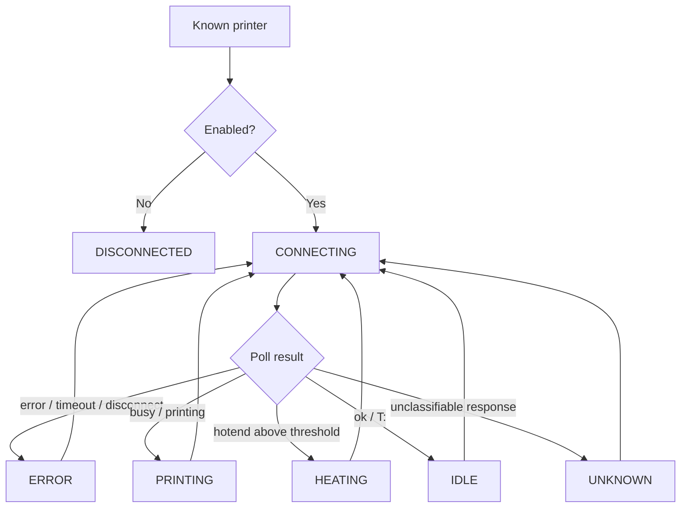

# Specification

## State machine

The runtime state model defines the observable lifecycle of each configured printer node.



### States

```text
DISCONNECTED
CONNECTING
IDLE
HEATING
PRINTING
ERROR
UNKNOWN
```

### Rules

* Disabled printer -> `DISCONNECTED`
* Monitoring start for enabled printer -> `CONNECTING`
* Poll failure -> `ERROR`
* `UNKNOWN` is reserved for successful but unclassifiable responses
* Printer failures must remain isolated to the affected printer
* API must expose runtime/cache state only

### Response classification

```text
contains "error", "kill", or "halted" -> ERROR
contains "busy" or "printing"         -> PRINTING
hotend above heating threshold        -> HEATING
contains "ok" or "t:"                 -> IDLE
otherwise                             -> UNKNOWN
```

### API note

* unknown printer -> `404`
* known printer without usable monitoring result -> `DISCONNECTED`

One important point: this last API note is the **desired spec**, but your current implementation still returns `UNKNOWN` when no cached snapshot exists. So if you put this short spec in the docs, the code should later be aligned to it.
